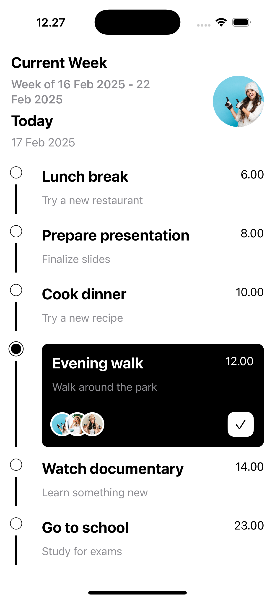

# Orderly - Task Management App

<p align="center">
  
</p>

## 📌 About Orderly
Orderly is a powerful **task management app** designed to help you efficiently track your daily activities and collaborate with team members. Whether you're managing personal to-dos or working on group projects, Orderly keeps everything organized in one place.

## ✨ Features
- **📅 Task Tracking:** Add and manage daily tasks with ease.
- **👥 Member Management:** Assign tasks and track members involved in specific activities.
- **📊 Weekly Overview:** Get a clear view of tasks planned for the week.
- **🎨 Modern UI:** Clean and user-friendly interface using SwiftUI.

## 🚀 Future Updates
- **🔔 Reminders & Notifications** – Get timely alerts for upcoming tasks.
- **📌 Task Prioritization** – Set priority levels for better task management.
- **📅 Calendar Integration** – Sync tasks with your calendar.
- **☁️ Cloud Sync** – Access your tasks across multiple devices.

## 🛠️ Tech Stack
- **Language:** Swift
- **Framework:** SwiftUI
- **Architecture:** MVVM (Model-View-ViewModel)
- **Data Persistence:** SwiftData

## 📂 Project Structure
```
Orderly/
│── Models/          # Data models
│── ViewModels/      # Business logic & state management
│── Views/           # SwiftUI views
│── Services/        # API & data handling
│── Resources/       # Assets & other resources
│── OrderlyApp.swift # App entry point
```

## 📦 Installation
1. Clone the repository:
   ```sh
   git clone https://github.com/bayusedana26/Orderly.git
   ```
2. Open `Orderly.xcodeproj` in Xcode.
3. Run the app on a simulator or device.

## 🤝 Contributing
Contributions are welcome! Feel free to submit pull requests for bug fixes, new features, or improvements.

---
⚡ **Stay tuned for more updates!**
